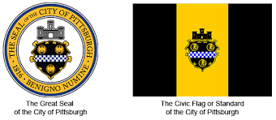

<!--
*** Thanks for taking a look at my portfolio. Hopefully 
*** there's something here that inspires you to create something 
*** of your own , or to contact me.
*** The code for this index file was inspired by
*** https://github.com/othneildrew/Best-README-Template/blob/master/README.md
-->

<!-- PROJECT LOGO -->
 

  

  <h3 align="center">The Pittsburgh Project</h3>

  

    A tale of two cities:  
    Ranked 3rd most livable city in the US by The Economist.   
    Ranked 3rd worst for racial equity in the US by The Reinvestment Fund
       
    <a href="https://github.com/dts0112/docs"><strong>Explore the maps »</strong></a>
     
     
    <a href="">Racial Inequity</a>
    ·
    <a href="">Income Inequity</a>
    ·
    <a href="">Food Aparthied</a>
    ·
    <a href="">How You Can Help</a>
  

<!-- TABLE OF CONTENTS -->

  
Table of Contents

  <ol>
    <li>
      <a href="#about-the-project">About The Project</a>
      <ul>
        <li><a href="#where-does-the-data-come-from">Where does the data come from?</a></li>
        <li><a href="#who-funded-this-project">Who funded this project?"</a></li>
      </ul>
    </li>
    <li>
      <a href="#what-is-pittsburgh">What is Pittsburgh?</a>
      <ul>
        <li><a href="#how-big-is-pittsburgh">How big is Pittsburgh?</a></li>
        <li><a href="#how-many-people-live-here">How many people live here?</a></li>
        <li><a href="#interesting-facts-about-PGH">Interesting facts about PGH</a></li>
        <li><a href="#municipal-boundaries">Municipal boundaries</a></li>
      </ul>
    </li>
    <li><a href="#usage">Air Quality in Poor Neighborhoods</a></li>
    <li><a href="#roadmap">Food Deserts</a></li>
    <li><a href="#contributing">Low Access to food</a></li>
    <li><a href="#license">Gentrification</a></li>
    <li><a href="#contact">Historic racism</a></li>
    <li><a href="#acknowledgments">Stop and Frisk</a></li>
    <li><a href="#contact">Pre gentrification and Home Ownership change in the past 10 years </a></li>
    <li><a href="#acknowledgments">Action Housing</a></li>
    <li><a href="#acknowledgments">Liberty Avenue downtown - Most depressing street in America?</a></li>
    <li><a href="#usage">Dude, Where's my bus?</a></li>
    <li><a href="#roadmap">311 is a joke in your town</a></li>
    <li><a href="#contributing">Toxic developments - why even the rich should be concerned</a></li>
    <li></li>
    <li></li>
    <li></li>
    <li></li>
    <li></li>
    <li></li>
  </ol>

<!-- ABOUT THE PROJECT -->
## About The Project

<!-- Need a good pic here!
[![Product Name Screen Shot][product-screenshot]](https://example.com)
-->
In this examination of Pittsburgh, Pennsylvania (aka PGH) we will take you on a tour using maps and data that will
give you a deeper understanding of what's really going on here. We'll present visual boundaries: City Council Districts / voting wards /
neighborhoods and more, combined with various datasets from entities such as the US Census, Bureau of Labor Statistics, the USDA, and NASA, to name a few. After this journey you will understand what factors make Pittsburgh one of the worst cities in America for 'racial' and income inequity.

Pittsburgh is one of the worst cities for racial and economic inequity?:
* Allegheny County says... `'PGH... not a good place for people of color'`.
* The reinvestment Fund ranked Pittsburgh **3rd worst in the country**.
* Listen to my podcast about living with Martins and Bernies and more.

(<a href="#top">back to top</a>)

### Where does the data come from?

The data for the maps, charts, and and other documents included in this project come from the following sources. 

* [NASA](https://nasa.gov/)
* [USDA](https://usda.gov/)
* [US Census](https://census.gov/)
* [Western PA Regional Data Center](https://wprdc.gov/)
* [Pennsylvania Spatial Data Access](https://www.pasda.psu.edu/)
* [Bureau of Labor Statistics](https://www.bls.gov/)
* [The Economist](https://www.eiu.com/n/campaigns/global-liveability-index-2021/)
* [The Reinvestment Fund](https://www.reinvestment.com/)

(<a href="#top">back to top</a>)

<!-- Who funded this project -->
### Who funded this project?

This project has not yet been funded. It was built using free cloud-based technology and data that is free to the public.
The content developers, researchers, data analysts, programmers, and web designers all
donated thier time.

<!-- What is Pittsburgh? -->
## What is Pittsburgh?
Pittsburgh, PGH, Steel City, City of Bridges, Iron City, BlitzBurgh, DirtyBurgh, Paris of Appalachia, The 412...

is a City
<!-- pgh outline!
[![Product Name Screen Shot][product-screenshot]](https://example.com)
-->

in Allegheny County
<!-- PGH in AlleG
[![Product Name Screen Shot][product-screenshot]](https://example.com)
-->

in Western Pennsylvania
<!-- pgh in PA outline!
[![Product Name Screen Shot][product-screenshot]](https://example.com)
-->

in the United States of America, Continent of North America, Earth
<!-- pgh on interactive map zoomed way out!
[![Product Name Screen Shot][product-screenshot]](https://example.com)
-->

### How Big is Pittsburgh?

Pittsburth is 55.37 square miles according to the U.S. Census Bureau. 
* Bigger than Boston(48.28 sq mi), San Francisco(46.87 sq mi), and Miami(35.87 sq mi)
* Smaller than Los Angeles(468.67), New York(302.64), and Philadelphia (134.1). 

_U.S. Census land area data compiled by [indexmundi](https://www.indexmundi.com/facts/united-states/quick-facts/cities/rank/land-area)_

<!-- USAGE EXAMPLES -->
## How many people live here?
There were 302,971 people living in Pittsburgh in 2020. Down from 305,704 in 2010.  
This is about 0.09 percent of the total population of the United States.  
About 1 in every 1090 people in the U.S. live in Pittsburgh

_See more population statistics, and compare them to Cincinnati and Austin at the  [U.S. Census](https://www.census.gov/quickfacts/fact/table/cincinnaticityohio,pittsburghcitypennsylvania,austincitytexas,US/RTN130212)_

(<a href="#top">back to top</a>)

<!-- ROADMAP -->
## Roadmap

- [x] Add Changelog
- [x] Add back to top links
- [ ] Add Additional Templates w/ Examples
- [ ] Add "components" document to easily copy & paste sections of the readme
- [ ] Multi-language Support
    - [ ] Chinese
    - [ ] Spanish

See the [open issues](https://github.com/othneildrew/Best-README-Template/issues) for a full list of proposed features (and known issues).

(<a href="#top">back to top</a>)

<!-- CONTRIBUTING -->
## Contributing

Contributions are what make the open source community such an amazing place to learn, inspire, and create. Any contributions you make are **greatly appreciated**.

If you have a suggestion that would make this better, please fork the repo and create a pull request. You can also simply open an issue with the tag "enhancement".
Don't forget to give the project a star! Thanks again!

1. Fork the Project
2. Create your Feature Branch (`git checkout -b feature/AmazingFeature`)
3. Commit your Changes (`git commit -m 'Add some AmazingFeature'`)
4. Push to the Branch (`git push origin feature/AmazingFeature`)
5. Open a Pull Request

(<a href="#top">back to top</a>)

<!-- LICENSE -->
## License

Distributed under the MIT License. See `LICENSE.txt` for more information.

(<a href="#top">back to top</a>)

<!-- CONTACT -->
## Contact

Your Name - [@your_twitter](https://twitter.com/your_username) - email@example.com

Project Link: [https://github.com/your_username/repo_name](https://github.com/your_username/repo_name)

(<a href="#top">back to top</a>)

<!-- ACKNOWLEDGMENTS -->
## Acknowledgments

Use this space to list resources you find helpful and would like to give credit to. I've included a few of my favorites to kick things off!
* [Source code inspiration for this page](https://github.com/othneildrew/Best-README-Template/blob/master/README.md)
* [Choose an Open Source License](https://choosealicense.com)
* [GitHub Emoji Cheat Sheet](https://www.webpagefx.com/tools/emoji-cheat-sheet)
* [Malven's Flexbox Cheatsheet](https://flexbox.malven.co/)
* [Malven's Grid Cheatsheet](https://grid.malven.co/)
* [Img Shields](https://shields.io)
* [GitHub Pages](https://pages.github.com)
* [Font Awesome](https://fontawesome.com)
* [React Icons](https://react-icons.github.io/react-icons/search)

(<a href="#top">back to top</a>)

<!-- MARKDOWN LINKS & IMAGES -->
<!-- https://www.markdownguide.org/basic-syntax/#reference-style-links -->
[contributors-shield]: https://img.shields.io/github/contributors/othneildrew/Best-README-Template.svg?style=for-the-badge
[contributors-url]: https://github.com/othneildrew/Best-README-Template/graphs/contributors
[forks-shield]: https://img.shields.io/github/forks/othneildrew/Best-README-Template.svg?style=for-the-badge
[forks-url]: https://github.com/othneildrew/Best-README-Template/network/members
[stars-shield]: https://img.shields.io/github/stars/othneildrew/Best-README-Template.svg?style=for-the-badge
[stars-url]: https://github.com/othneildrew/Best-README-Template/stargazers
[issues-shield]: https://img.shields.io/github/issues/othneildrew/Best-README-Template.svg?style=for-the-badge
[issues-url]: https://github.com/othneildrew/Best-README-Template/issues
[license-shield]: https://img.shields.io/github/license/othneildrew/Best-README-Template.svg?style=for-the-badge
[license-url]: https://github.com/othneildrew/Best-README-Template/blob/master/LICENSE.txt
[linkedin-shield]: https://img.shields.io/badge/-LinkedIn-black.svg?style=for-the-badge&logo=linkedin&colorB=555
[linkedin-url]: https://linkedin.com/in/othneildrew
[product-screenshot]: images/screenshot.png
